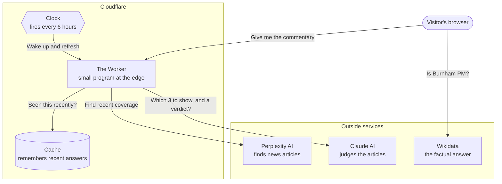
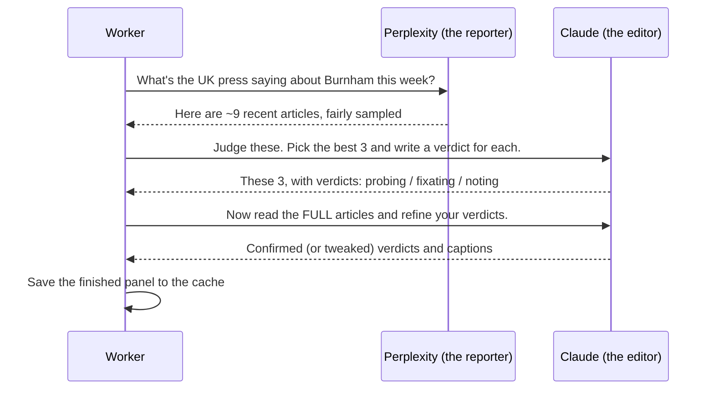

# Architecture

> *Is Andy Burnham the UK Prime Minister yet?* — a one-page website that answers a single yes/no question, and quietly raises an eyebrow at how the press is covering it.

This document explains how the site works behind the scenes. It's written for a curious reader who isn't a programmer — if you can follow how a newspaper newsroom works, you can follow this. Each section starts with *why* a thing exists, then *what* it actually does.

---

## What the site does

The whole site exists to answer one question: **has Andy Burnham become Prime Minister yet?** Almost always, the answer is "Not yet." One day — maybe — it will flip to "Yes," and the page will know within hours, all on its own, without anyone touching it.

There are three things on the page:

1. **The headline answer** — a giant "Not yet." (or one day, "Yes.")
2. **The odds desk** — a tongue-in-cheek probability, like "24% he's behind the famous door by September."
3. **The press panel** — three real, recent newspaper articles about Burnham, each with a one-line verdict that gently calls out whether the coverage is *substantive* or just *fixating on his anorak*.

The joke of the site is the contrast: a calm, factual answer at the top, and underneath it, an affectionate skewering of how breathlessly the British press covers Westminster gossip.

---

## Why it's built this way

Every technical choice on this site flows from four simple constraints. Keep these in mind and the rest of the design more or less explains itself.

- **It must answer truthfully, by itself.** The "Yes / Not yet" answer can't be something a human types in and forgets to update. It has to come from a source of fact that updates automatically when Burnham actually becomes PM.
- **It must be cheap to run.** This is a hobby site. It calls some paid artificial-intelligence services, so it must avoid paying for the same work over and over.
- **It must be fast for visitors.** Nobody waits 30 seconds for a website to load. The page should appear more or less instantly.
- **It must never break embarrassingly.** If a paid service is down, or returns nonsense, the page should still look finished and on point — never a blank screen or an error.

---

## System overview

The site runs entirely on **Cloudflare**, a service that hosts websites on computers spread around the world so they're close to whoever's visiting. There's no traditional "server" sitting in a cupboard somewhere — just a small program (a "Worker") that wakes up when needed.

Here's the whole system on one page:

Two important things to notice:

- **The factual answer and the commentary come from different places.** The big "Not yet" comes straight from **Wikidata** (more on that below), asked by the visitor's own browser. The clever press commentary comes from the **Worker**. They're kept separate on purpose — so that even if all the fancy AI commentary fails, the factual answer still works.
- **The expensive work happens on a timer, not on every visit.** That's the cache and the clock, and it's the single most important idea for keeping the site cheap and fast.

---

## The front page

This is everything the visitor actually sees. It's a single web page (`public/index.html`) styled to look like an old-fashioned broadsheet newspaper, plus a script (`public/app.js`) that fills in the live bits.

### The headline answer — straight from the record books

When you load the page, your *own browser* quietly asks **Wikidata** a question. Wikidata is the free, community-run database of facts that sits behind Wikipedia. It knows, as a structured fact, who the current Prime Minister of the United Kingdom is.

The page asks: *"Who are the people recorded as holding the office of UK Prime Minister?"* and then simply checks whether "Burnham" is in the answer. If it is — "Yes." If not — "Not yet."

**Why do it this way?** Because it satisfies the first constraint: the answer is *true by construction* and updates itself. The day Burnham actually becomes PM, Wikipedia and Wikidata will be updated within minutes by the world's editors, and this site will start saying "Yes" without anyone touching the code. It's the calm, authoritative heartbeat of the whole site.

If Wikidata is slow or unreachable, the page tries a couple more times, then quietly defaults to "Not yet" — which, statistically, is almost certainly still correct.

### The odds desk and the press panel — from the Worker

While the headline is being fetched, the page also asks the Worker for the "commentary": the probability number and the three articles. This arrives as a small packet of data that the page lays out into the odds readout and the three article cards.

### A few hidden controls

For testing and demos, you can add things to the web address to force different looks: `?force=yes` pretends Burnham won, `?force=no` forces the default, `?simulate=offline` shows what happens when the commentary service is down, and `?simulate=judge-fail` shows the graceful fallback. Handy for checking every state looks right without waiting for the real world to cooperate.

---

## The newsroom pipeline — the clever bit

This is the heart of the site, and it's a bit like a little newsroom run by two different AIs working in sequence. When the commentary needs refreshing, the Worker runs a three-stage assembly line (`runPipeline` in `src/worker.js`):

**Stage 1 — the reporter (Perplexity).** Perplexity is an AI that can search the live web. The Worker asks it for a *fair, representative sample* of around nine recent articles about Burnham's chances — a spread across serious news, opinion, and lighter colour pieces. Crucially, it's told **not** to hunt for the silliest articles. The site's integrity depends on reflecting the real coverage, not a cherry-picked caricature.

**Stage 2 — the editor (Claude).** The pool of articles then goes to **Claude**, Anthropic's AI, acting as a dry, sardonic editor. Its job is to pick the best three to show and give each a one-word verdict:

- **Probing** — the article engages with what actually matters (what Burnham would *do* in office, the legitimacy of a mid-term handover).
- **Fixating** — it dwells on froth: his coat, his haircut, a "secret meeting" that was really just a diary appointment.
- **Noting** — a plain, factual update, neither substantive nor silly.

The editor is given careful instructions and real worked examples so its judgement is consistent and fair — it's told to reflect the coverage honestly, never to invent froth or force a joke. The whole personality of the site lives in this one set of instructions (the "prompt").

**Stage 3 — the fact-check (Claude again).** Because the editor only saw short snippets in Stage 2, the Worker then fetches the *full text* of the chosen articles and asks Claude to look again and refine its verdicts now that it has the complete picture. This stage is optional — if an article can't be fetched, the site simply keeps the earlier verdict. It's a "make it better if we can" step, not a "fail if we can't" one.

The finished result — a probability, a one-line summary, and three judged articles — is what the front page displays.

---

## The cache and the clock — why it's fast and cheap

Here's the problem: Stages 1–3 above call paid AI services and can take up to half a minute. If every single visitor triggered that, the site would be slow *and* expensive — violating two of our four constraints at once.

The solution is a **cache**: a little memory (Cloudflare "KV") that stores the most recently produced panel. When you visit, the Worker checks the cache first. If there's a recent answer there — which there almost always is — it hands it straight back, instantly, with no AI calls and no cost.

So how does the cache stay fresh? A **clock** (a "cron trigger") wakes the Worker up **every six hours**, runs the full newsroom pipeline once, and tucks the new result into the cache. That means the expensive work happens four times a day, total — not once per visitor. Visitors always get a recent, pre-made answer in an instant.

There's one more subtle touch. If the pipeline ever comes back *empty* (say Perplexity hiccups), the Worker remembers that emptiness for only two minutes instead of six hours — so a brief outage doesn't leave the site blank for a quarter of a day, but a flood of visitors during that window still can't each re-trigger the expensive pipeline.

---

## Keeping it safe

Even a joke site that takes content from the open web has to be careful. A few deliberate safeguards:

- **No untrusted text is ever treated as code.** The article titles and captions come from AI services and the open web, which means they can't be fully trusted. The page inserts every one of them as *plain text only*, so a maliciously crafted headline can never run as a script in a visitor's browser. (This is the classic "cross-site scripting" defence.)
- **The Worker won't fetch dangerous addresses.** In Stage 3, the Worker fetches the full text of articles — but only from genuine public web addresses. It explicitly refuses to reach internal or private network addresses, which closes a common trick (called "SSRF") where an attacker feeds in a sneaky internal URL.
- **Security headers on every response.** The Worker attaches a set of standard browser-security instructions (a "Content Security Policy" and friends) to everything it serves, telling browsers exactly what the page is and isn't allowed to do.
- **The manual refresh button is locked.** There's a hidden `/api/refresh` address that forces an immediate rebuild. It's protected by a secret password sent in a request header — and deliberately *not* in the web address, because addresses leak into logs and browser history.
- **No secrets in the code.** The API keys for Perplexity and Claude are stored as Cloudflare secrets, never written into the files that live in the public code repository.

---

## When things break — graceful by design

The fourth constraint was "never break embarrassingly," and the site takes it seriously. There's a fallback for every failure:

| If this fails… | …the visitor sees |
| --- | --- |
| Wikidata is unreachable | "Not yet" (the safe default, almost always correct) |
| The commentary service is down | A pre-written "from the archive" trio of (fictional) articles |
| The AI editor returns nonsense | A single plain, factual article card instead of a panel |
| The whole pipeline errors out | An empty-but-tidy result, served calmly with no error message |

The page also enforces a **minimum two-second loading moment** with rotating words like "Cogitating…" and "Consulting the scoreboard…" — partly for charm, partly so a lightning-fast cache hit doesn't flash past before the visitor's eye can catch it.

---

## Deployment

The site lives on Cloudflare and is managed with a tool called **Wrangler**. The configuration (`wrangler.toml`) ties together the four moving parts: the Worker program, the static page files, the cache, and the six-hourly clock.

Publishing a new version is a single command (`npm run deploy`). The static page is served directly by Cloudflare's network for speed, with the Worker stepping in front of it just long enough to attach the security headers.

Testing is automated too: a suite of tests (run with `npm test`) checks the Worker's logic and, importantly, confirms that the "treat everything as plain text" XSS defence actually holds.

---

## Where to look next

This document is the map. The detailed territory lives in:

- **`src/worker.js`** — the Worker: the pipeline, the cache, the security headers.
- **`public/index.html`** and **`public/app.js`** — the front page and its live behaviour.
- **`REFERENCE/`** — how-it-works notes, the testing strategy, and environment setup.
- **`SPECIFICATIONS/ARCHIVE/`** — the original phase-by-phase plans the site was built from.
- **`README.md`** — the quick-start summary.

The short version, though, is the one at the very top: a calm factual answer from Wikidata, a little AI-run newsroom producing the commentary on a timer, a cache making it all fast and cheap, and a safety net under every part of it.
