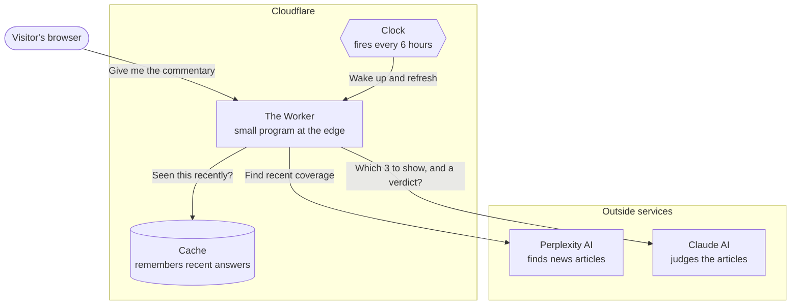
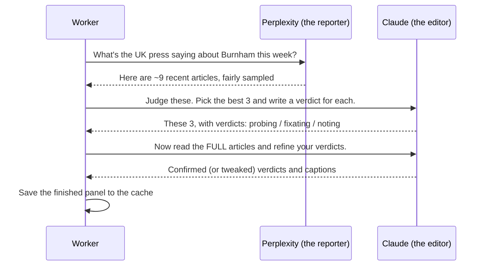

# Architecture

> *Is Andy Burnham the UK Prime Minister yet?* — a one-page website that answers a single yes/no question, and quietly raises an eyebrow at how the press is covering it.

This document explains how the site works behind the scenes. It's written for a curious reader who isn't a programmer — if you can follow how a newspaper newsroom works, you can follow this. Each section starts with *why* a thing exists, then *what* it actually does.

---

## What the site does

The whole site exists to answer one question: **has Andy Burnham become Prime Minister yet?** He now has, so the answer is a settled "Yes." For most of the site's life the answer was "Not yet," and a live check watched for the day it would flip; that day has arrived, so the answer is now a fixed constant and the live check has been retired.

There are three things on the page:

1. **The headline answer** — a giant "Yes."
2. **The odds desk** — a tongue-in-cheek probability, like "24% he's behind the famous door by September."
3. **The press panel** — three real, recent newspaper articles about Burnham, each with a one-line verdict that gently calls out whether the coverage is *substantive* or just *fixating on his anorak*.

The joke of the site is the contrast: a calm, factual answer at the top, and underneath it, an affectionate skewering of how breathlessly the British press covers Westminster gossip.

---

## Why it's built this way

Every technical choice on this site flows from four simple constraints. Keep these in mind and the rest of the design more or less explains itself.

- **It must answer truthfully.** For most of the site's life this meant the "Yes / Not yet" answer couldn't be something a human typed in and forgot to update — it came from a source of fact that updated automatically. Now that Burnham *is* PM the question is settled, so the answer is a fixed "Yes" and the automatic check has been retired (see ["The headline answer"](#the-headline-answer--a-settled-question) below).
- **It must be cheap to run.** This is a hobby site. It calls some paid artificial-intelligence services, so it must avoid paying for the same work over and over.
- **It must be fast for visitors.** Nobody waits 30 seconds for a website to load. The page should appear more or less instantly.
- **It must never break embarrassingly.** If a paid service is down, or returns nonsense, the page should still look finished and on point — never a blank screen or an error.

---

## System overview

The site runs entirely on **Cloudflare**, a service that hosts websites on computers spread around the world so they're close to whoever's visiting. There's no traditional "server" sitting in a cupboard somewhere — just a small program (a "Worker") that wakes up when needed.

Here's the whole system on one page:

Two important things to notice:

- **The factual answer and the commentary come from different places.** The big "Yes" is now a settled fact baked straight into the page (more on that below) — no live lookup. The clever press commentary comes from the **Worker**. They're kept separate on purpose — so that even if all the fancy AI commentary fails, the factual answer still stands.
- **The expensive work happens on a timer, not on every visit.** That's the cache and the clock, and it's the single most important idea for keeping the site cheap and fast.

---

## The front page

This is everything the visitor actually sees. It's a single web page (`public/index.html`) styled to look like an old-fashioned broadsheet newspaper, plus a script (`public/app.js`) that fills in the live bits.

### The headline answer — a settled question

Andy Burnham is Prime Minister, so the headline answer is simply "Yes." It's a fixed constant in `public/app.js` (`DEFAULT_ANSWER_YES`), served with the page — there's no live lookup to perform. It's painted immediately on load; only the odds desk and press panel below it show a brief loading moment, because they genuinely fetch from the Worker.

The answer actually lives in **two** places that must agree: `DEFAULT_ANSWER_YES` (what the script renders) and the static defaults hard-coded into `public/index.html` (the hero text, its colour, the PM count, the footer status), which are what a scriptless visitor — or the very first paint before the script runs — sees. To reverse the verdict, flip the constant *and* update those static defaults.

**How it used to work.** Until Burnham took office, the page couldn't hard-code the answer, so your *own browser* quietly asked **Wikidata** — the free, community-run database of facts behind Wikipedia — *"Who is recorded as holding the office of UK Prime Minister?"* and checked whether "Burnham" was in the reply. That kept the answer *true by construction* and self-updating, right up to the day it flipped. With the question now settled, that live check has been retired, and the browser no longer contacts Wikidata at all.

For anyone wanting to see the old "Not yet" state, appending `?force=no` to the URL still renders it.

### The odds desk and the press panel — from the Worker

With the headline already settled, the page asks the Worker for the "commentary": the probability number and the three articles. This arrives as a small packet of data that the page lays out into the odds readout and the three article cards.

### A few hidden controls

For testing and demos, you can add things to the web address to force different looks: `?force=yes` pins the "Yes" answer (also the default now), `?force=no` shows the historical "Not yet" state, `?simulate=offline` shows what happens when the commentary service is down, and `?simulate=judge-fail` shows the graceful fallback. Handy for checking every state looks right.

---

## The newsroom pipeline — the clever bit

This is the heart of the site, and it's a bit like a little newsroom run by two different AIs working in sequence. When the commentary needs refreshing, the Worker runs a three-stage assembly line (`runPipeline` in `src/worker.js`):

**Stage 1 — the reporter (Perplexity).** Perplexity is an AI that can search the live web. The Worker asks it for a *fair, representative sample* of around nine recent articles about Burnham's chances — a spread across serious news, opinion, and lighter colour pieces. It's asked to look right across the political and editorial spectrum — the sober broadsheets, the tabloids, the broadcasters, the outrage-driven and opinion outlets (the GB News end of things), and the small independents — balanced left, centre and right, so the sample isn't quietly skewed toward the calm middle. Crucially, though, it's still told **not** to hunt for the silliest articles, and never to invent one: it widens *where we look*, not *what we favour*. The site's integrity depends on reflecting the real coverage, not a cherry-picked caricature.

**Stage 2 — the editor (Claude).** The pool of articles then goes to **Claude**, Anthropic's AI, acting as a dry, sardonic editor. Its job is to pick the best three to show and give each a one-word verdict:

- **Probing** — the article engages with what actually matters (what Burnham would *do* in office, the legitimacy of a mid-term handover).
- **Fixating** — it dwells on froth: his coat, his haircut, a "secret meeting" that was really just a diary appointment. The caption openly mocks the coverage for it.
- **Noting** — a plain, factual update, neither substantive nor silly.

The editor is given careful instructions and real worked examples so its judgement is consistent and fair — it's told to reflect the coverage honestly, never to invent froth or force a joke. The whole personality of the site lives in this one set of instructions (the "prompt").

**Stage 3 — the fact-check (Claude again).** Because the editor only saw short snippets in Stage 2, the Worker then fetches the *full text* of the chosen articles and asks Claude to look again and refine its verdicts now that it has the complete picture. This stage is optional — if an article can't be fetched, the site simply keeps the earlier verdict. It's a "make it better if we can" step, not a "fail if we can't" one.

The finished result — a probability, a one-line summary, and three judged articles — is what the front page displays.

---

## The cache and the clock — why it's fast and cheap

Here's the problem: Stages 1–3 above call paid AI services and can take up to half a minute. If every single visitor triggered that, the site would be slow *and* expensive — violating two of our four constraints at once.

The solution is a **cache**: a little memory (Cloudflare "KV") that stores the most recently produced panel. When you visit, the Worker checks the cache first. If there's a recent answer there — which there almost always is — it hands it straight back, instantly, with no AI calls and no cost.

So how does the cache stay fresh? A **clock** (a "cron trigger") wakes the Worker up **every six hours**, runs the full newsroom pipeline once, and tucks the new result into the cache. That means the expensive work happens four times a day, total — not once per visitor. Visitors always get a recent, pre-made answer in an instant.

There's one more subtle touch. If the pipeline ever comes back *empty* (say Perplexity hiccups), the Worker remembers that emptiness for only two minutes instead of six hours — so a brief outage doesn't leave the site blank for a quarter of a day, but a flood of visitors during that window still can't each re-trigger the expensive pipeline.

---

## The archive — a memory that also stops repeats

For a niche question like this one, the newspapers often say much the same thing two editions running. Left to itself, the newsroom would keep picking the same strongest stories every six hours, and the front page would look frozen even though the clock was ticking.

So the site keeps a second, permanent memory: the **archive**. It's a running list, newest-first, of every article that has ever appeared on the panel — kept in the same Cloudflare KV store, but with no expiry. It does two jobs at once:

- **It stops repeats.** Each time the clock fires, before handing the articles to the editor, the Worker sets aside the ones already in the archive and offers up the genuinely *new* coverage first. When there are at least three fresh stories, the panel is built entirely from them — so the front page visibly moves on. On a quiet news day with little new, it tops the pool back up with older pieces rather than show a bare panel, and honestly accepts that a card or two may repeat.
- **It powers the archive page.** Because every shown article is filed away with the date it first appeared, the site can offer a separate **Archive** sub-page (linked from the "Meanwhile, the papers say…" heading) — a simple, paginated list, twenty clippings a page, newest first. It reuses the exact same article-card machinery as the front page, so a clipping looks identical whether it's today's news or a filed cutting. The page also carries a **verdict filter** — chips for All (the default), Probing, Noted and Fixating, each showing its count — so a reader can see the mix at a glance or read just one type. The filter is a query param on the archive endpoint (`?verdict=fixating`), so the Worker filters the full list *before* paginating and the counts, paging and empty-states all stay honest; the per-verdict counts it returns always describe the whole archive, regardless of the active filter.

Only the six-hourly clock ever *writes* to the archive. That single-writer rule matters: if visitors could write to it too, two updates landing at once could quietly clobber each other. Keeping one writer sidesteps that entirely.

---

## Keeping it safe

Even a joke site that takes content from the open web has to be careful. A few deliberate safeguards:

- **No untrusted text is ever treated as code.** The article titles and captions come from AI services and the open web, which means they can't be fully trusted. The page inserts every one of them as *plain text only*, so a maliciously crafted headline can never run as a script in a visitor's browser. (This is the classic "cross-site scripting" defence.)
- **The Worker won't fetch dangerous addresses.** In Stage 3, the Worker fetches the full text of articles — but only from genuine public web addresses. It explicitly refuses to reach internal or private network addresses, which closes a common trick (called "SSRF") where an attacker feeds in a sneaky internal URL.
- **Security headers on every response.** The Worker attaches a set of standard browser-security instructions (a "Content Security Policy" and friends) to everything it serves, telling browsers exactly what the page is and isn't allowed to do.
- **The manual refresh button is locked.** There's a hidden `/api/refresh` address that forces an immediate rebuild. It's protected by a secret password sent in a request header — and deliberately *not* in the web address, because addresses leak into logs and browser history.
- **No secrets in the code.** The API keys for Perplexity and Claude are stored as Cloudflare secrets, never written into the files that live in the public code repository.

---

## When things break — graceful by design

The fourth constraint was "never break embarrassingly," and the site takes it seriously. There's a fallback for every failure:

| If this fails… | …the visitor sees |
| --- | --- |
| The commentary service is down | A pre-written "from the archive" trio of (fictional) articles |
| The AI editor returns nonsense | A single plain, factual article card instead of a panel |
| The whole pipeline errors out | An empty-but-tidy result, served calmly with no error message |

The page also enforces a **minimum two-second loading moment** on the odds desk and press panel — partly for charm, partly so a lightning-fast cache hit doesn't flash past before the visitor's eye can catch it. The headline answer is exempt: it's a settled fact, so it paints immediately rather than sitting behind the delay.

---

## Deployment

The site lives on Cloudflare and is managed with a tool called **Wrangler**. The configuration (`wrangler.toml`) ties together the four moving parts: the Worker program, the static page files, the cache, and the six-hourly clock.

Publishing a new version is a single command (`npm run deploy`). The static page is served directly by Cloudflare's network for speed, with the Worker stepping in front of it just long enough to attach the security headers.

Testing is automated too: a suite of tests (run with `npm test`) checks the Worker's logic and, importantly, confirms that the "treat everything as plain text" XSS defence actually holds.

---

## Where to look next

This document is the map. The detailed territory lives in:

- **`src/worker.js`** — the Worker: the pipeline, the cache, the archive, the security headers.
- **`public/index.html`** and **`public/app.js`** — the front page and its live behaviour.
- **`public/archive.html`** and **`public/archive.js`** — the paginated archive sub-page.
- **`REFERENCE/`** — how-it-works notes, the testing strategy, and environment setup.
- **`SPECIFICATIONS/ARCHIVE/`** — the original phase-by-phase plans the site was built from.
- **`README.md`** — the quick-start summary.

The short version, though, is the one at the very top: a calm, settled "Yes" baked into the page, a little AI-run newsroom producing the commentary on a timer, a cache making it all fast and cheap, and a safety net under every part of it.
